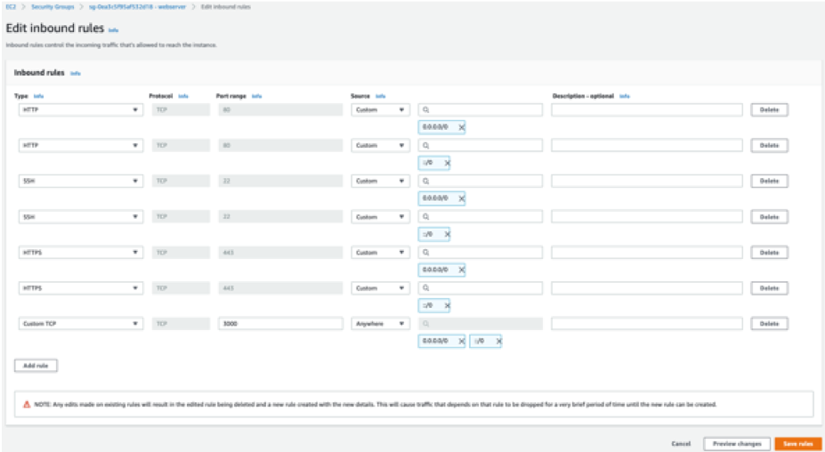

## How to Deploy a Node-Express App on Amazon EC2

The purpose of this repository is to demonstrate how to deploy a simple web application built by Express - Node.js web application framework on Amazon EC2  


###  Launch an Instance

- For the Instance Type, you might choose t3.micro which will be sufficient for
this demonstration.

- Update your Security Group Settings to allow SSH for login, HTTP for web access
as well as Custom TCP for 3000 port which will be listening port of the
application. Refer to below image in case needed:
<p align="center">
    
<p>


### Install Node on your Amazon EC2 Instance by running below commands :

- SSH into your instance and follow below commands

    ```bash
    $ sudo yum update -y
    $ curl -o- https://raw.githubusercontent.com/nvm-sh/nvm/v0.39.3/install.sh | bash
    $ . ~/.nvm/nvm.sh
    # Amazon Linux 2 does not currently support the current LTS release (version 18.x) of Node.js.
    $ nvm install 16 
    # to check whether the installation was successful   
    $ node -e "console.log('Running Node.js ' + process.version)"
    ```

### Install Git on your Amazon EC2 Instance by running below commands :

- SSH into your instance and follow below commands

    ```bash
    $ sudo yum install git -y
    $ git --version
    $ git clone https://github.com/aws-samples/amazon-ec2-demo-with-node-express
    $ cd amazon-ec2-demo-with-node-express/
    # to deploy packages and install dependencies  
    $ npm install
    $ node calculator.js
    ```

#### OPTIONAL : To keep you applications up and running all the time use an NPM Package.

- For the purpose of this demonstration, we're using [`PM2`](https://www.npmjs.com/package/pm2) which was already included in `package.json`
```bash
$ sudo pm2 calculator.js
```

Now you'll be able to use the web application on the Public IP (or DNS) of your
EC2 instance.

## Security

See [CONTRIBUTING](CONTRIBUTING.md#security-issue-notifications) for more information.

## License

This library is licensed under the MIT-0 License. See the LICENSE file.
